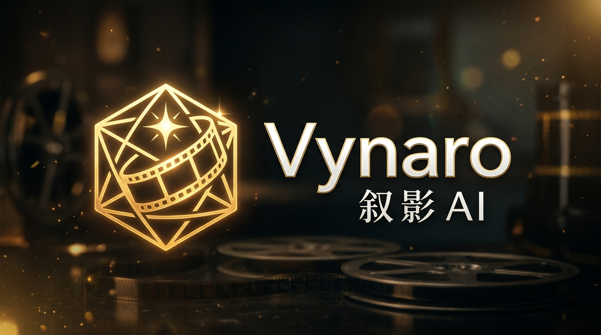
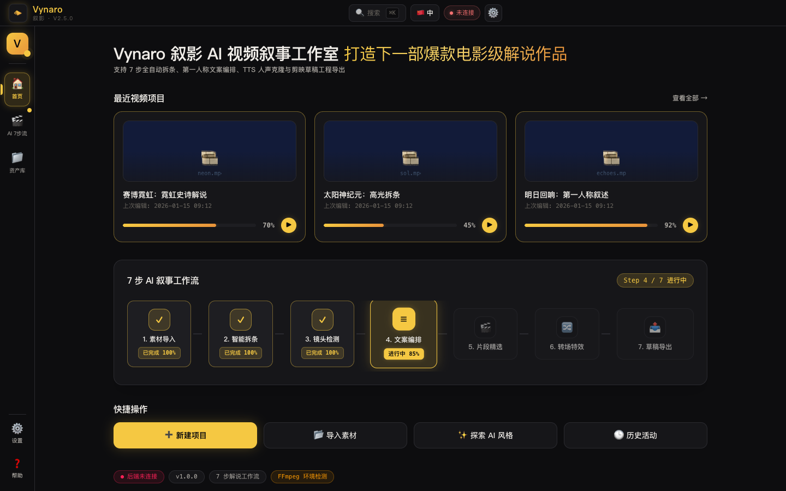
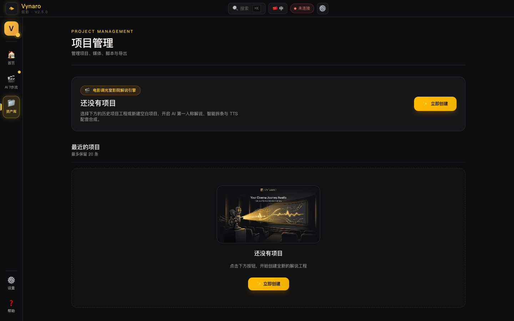
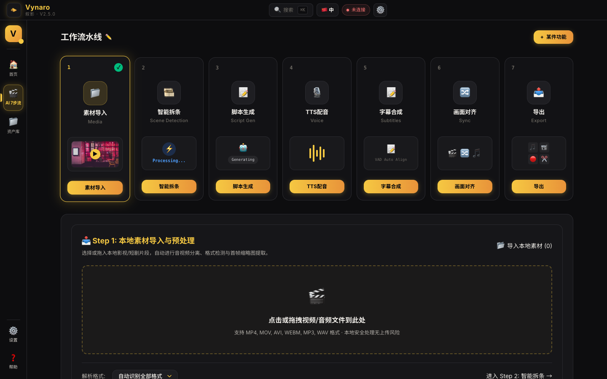
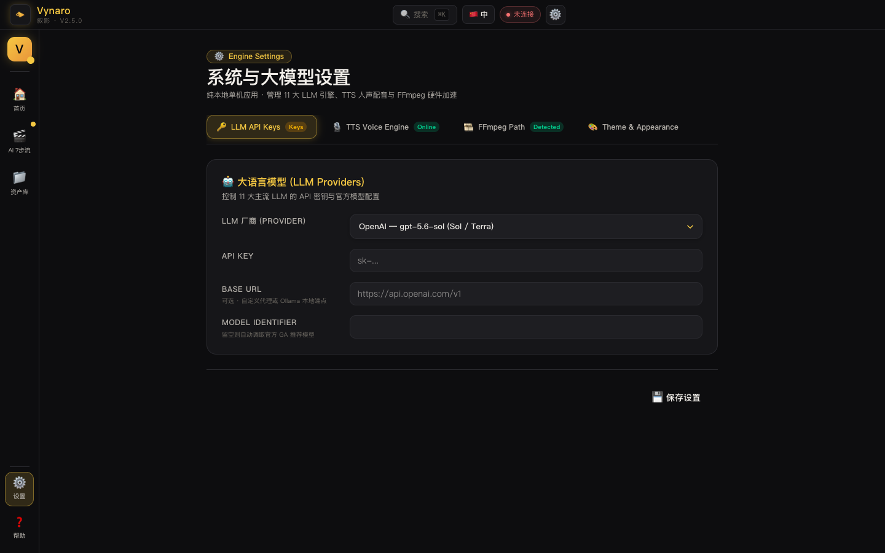

<!-- markdownlint-disable MD060 MD040 MD041 MD047 -->

<div align="center">



[](https://github.com/Agions/vynaro/releases) [](https://tauri.app) [](https://www.rust-lang.org) [](https://react.dev) [](https://www.typescriptlang.org) [](LICENSE)  
[](https://github.com/Agions/vynaro) [](https://github.com/Agions/vynaro) [](https://github.com/Agions/vynaro) [](https://github.com/Agions/vynaro)

</div>

---

## 🎬 核心定位

**Vynaro（叙影）** 是一款基于 **Tauri 2 + Rust + React 19** 深度研发的桌面端 AI 视频叙事与解说编辑器。

专为短剧拆条、电影解说、自媒体故事化创作设计，通过 **7 步卡片智能流水线**，自动完成影视/短剧片段的高完播率成片转化与剪映工程草稿（`.draft`）原生导出。

素材导入 ➔ 智能拆条 ➔ AI 独白脚本 ➔ TTS 配音与克隆 ➔ VAD 字幕对齐 ➔ 音画混流 ➔ 多平台/剪映草稿导出

---

## 🖥️ 桌面应用界面展示

<div align="center">

| 首页 Dashboard 概览 | 素材资产管理面板 |
| :---: | :---: |
|  |  |

| 7 步全自动解说生产工作区 | 11 大模型与 TTS 设置表单 |
| :---: | :---: |
|  |  |

</div>

---

## ⚡ 7 步全自动智能流水线


| 步骤 | 模块名称 | 核心技术与执行细节 |
| :--- | :--- | :--- |
| **Step 1** | **📥 素材导入与预处理** | 本地极速提取音视频流元数据（Resolution / FPS / Codec），自动生成缩略图 |
| **Step 2** | **✂️ FFmpeg 智能拆条** | 基于 FFmpeg 场景切面探测、情绪峰值吸附与关键帧序列化索引 |
| **Step 3** | **🤖 AI 第一人称独白** | 支持 Qwen 3.8 / DeepSeek V4 / GPT-5.6 等 11 大 LLM，提供主角独白/影评/吐槽 4 大风格 |
| **Step 4** | **🎙️ TTS 配音与人声克隆** | Edge-TTS + OpenAI-TTS + GPT-SoVITS 人声克隆，集成实时黄金波形与本地服务探针 |
| **Step 5** | **📝 VAD 字幕精准对齐** | 基于 FFmpeg `silencedetect` 语音端点检测，自动生成 SRT / VTT / ASS 字幕 |
| **Step 6** | **🎬 画面-声音智能混流** | 多轨时间轴毫秒级对齐，支持 BGM 背景降噪与音量比例调配 (`amix`) |
| **Step 7** | **📤 剪映草稿与多平台导出**| 原生导出剪映二次剪辑工程草稿 (`.draft`) 与 1080P 竖屏 (9:16) 成片 |

---

## 🧠 大模型与 TTS 引擎能力矩阵

### 11 大主流 LLM 引擎支持
* 🇨🇳 **通义千问 (Qwen)**: `qwen3.8-max`
* 🇨🇳 **DeepSeek**: `deepseek-v4-pro` / `deepseek-v4-flash`
* 🇺🇸 **OpenAI**: `gpt-5.6-sol`
* 🇺🇸 **Claude**: `claude-sonnet-5`
* 🇺🇸 **Gemini**: `gemini-3.6-flash` / `gemini-3.1-pro`
* 🇨🇳 **Kimi (月之暗面)**: `kimi-k3`
* 🇨🇳 **智谱 GLM**: `glm-5.2`
* 🇨🇳 **豆包 (Doubao)**: `doubao-seed-2-1-pro`
* 🇨🇳 **腾讯混元 (Hunyuan)**: `hunyuan-pro`
* 🏠 **本地模型 (Local)**: Ollama / LMStudio (`llama3.2` / `qwen2.5`)

---

## 🏛️ 项目架构设计

```
vynaro/
├── src/                  # React 19 + TypeScript 前端应用程序
├── src-tauri/            # Tauri 2.0 桌面应用程序入口 (Rust)
├── crates/
│   ├── vynaro-core       # 核心类型 (AppContext / VynaroError)
│   ├── vynaro-domain     # 领域模型 (Project / Timeline / MediaFile)
│   ├── vynaro-detect     # FFmpeg 探针 / 场景切分 / 音画混流
│   ├── vynaro-script     # 11 大 LLM 客户端与独白脚本引擎
│   ├── vynaro-voice      # Edge-TTS / OpenAI-TTS / GPT-SoVITS
│   ├── vynaro-subtitle   # FFmpeg silencedetect VAD 端点检测与字幕生成
│   ├── vynaro-compose    # 7 步流水线状态机与 DAG 执行器
│   ├── vynaro-export     # 剪映草稿 (.draft) 生成器与平台预设
│   ├── vynaro-storage    # 本地 SQLite / JSON 存储
│   └── vynaro-update     # 应用自动更新引擎
└── Makefile              # 常用构建与测试指令
```

---

## 🛠️ 本地开发环境搭建

```bash
# 1. 克隆代码仓库
git clone https://github.com/Agions/vynaro.git
cd vynaro

# 2. 安装前端依赖
pnpm install

# 3. 启动 Tauri 2 开发桌面端
pnpm tauri dev

# 4. 类型检查与代码校验
cargo check --workspace
npx tsc --noEmit
```

---

## 📜 许可证

基于 **[MIT License](LICENSE)** 许可协议开源。

© 2026 Agions  · Powered by Tauri 2, Rust & React 19
